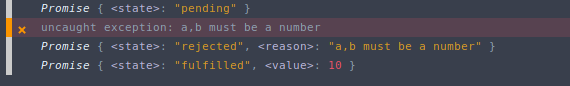

# Promise 

Sử dụng Promise trong Nodejs với Bluebird
## Định nghĩa:

Promise là đối tượng trong javascript mô tả sự hoàn thành hay thất bại của một tiến trình bất đồng bộ và trả về giá trị biểu hiện sự hoàn thành hay thất bại đó.

#### Syntax:
```js
new Promise(/*hàm thực thi*/(resolve,reject)=>{
    // logic
})
```
Khi ta khai báo new Promise, hàm thực thi đó sẽ được xử lý ngay lập tức và truyền ra hai hàm resolve() và reject(). Hai hàm resolve() và reject() khi được gọi sẽ hoặc hoàn thành (resolve) hoặc từ chối (reject) Promise đó một cách riêng rẽ. Promise sẽ xử lý một chuỗi các tiến trình bất đồng bộ, khi nó hoàn thành, promise sẽ gọi tới resolve() để "hoàn thành" chuỗi Promise hoặc gọi tới reject() để "từ chối" nếu có lỗi xảy ra.

Do xảy ra riêng rẽ, nếu ta bắt được lỗi (throw-catch) trong hàm thực thi, thì promise sẽ bị "từ chối" và loại bỏ đi giá trị trả về của hàm thực thi và ngược lại.

- Khởi tạo Promise dạng biến:
```js
const pro = new Promise((resolve, reject) => {
    // logic
    // if(true) resolve(logic)
    // else reject(error)
})

pro.then() // logic
```
- Khởi tạo dạng hàm trả về Promise:
```javascript
const pro = (a,b) => {
    return new Promise((resolve, reject) => {
        // logic
        // if(true) resolve(doSomethingAbout(a,b))
        // else reject(error)
    });
}

pro(a,b).then() // logic
```
#### Ba trạng thái của promise:



Một Promise sẽ nằm trong 3 trạng thái trên:
- pending: Trạng thái ban đầu của Promise, khi chưa hoàn thành hay từ chối
- fullified: Trạng thái đã hoàn thành của promise (khi đã resolve hoặc reject)
- rejected: Trạng thái "thất bại" của Promise (chủ yếu khi lỗi handling reject())

```html
 <!--dùng browser để giải thích!-->
<!DOCTYPE html>
<html lang="en">
<head>
    <meta charset="UTF-8">
    <title>Promise</title>
</head>
<body>
    <script type="text/javascript">
        const pro1 = new Promise((resolve, reject) => {
            // console.log(`Handling add()`);
            const add = (a, b) => {
                if (typeof (a) !== 'number' || typeof (b) !== 'number') {
                    reject('a,b must be a number')
                }
                resolve(a + b)
            }
            add(3, "7")
            // console.log(pro)
        }).then(val => {
            return val;
        })


        const pro2 = new Promise((resolve, reject) => {
            // console.log(`Handling add()`);
            const add = (a, b) => {
                if (typeof (a) !== 'number' || typeof (b) !== 'number') {
                    reject('a,b must be a number')
                }
                resolve(a + b)
            }
            add(3, 7)
        }).then(val => {
            return val;
        }, err => {
            return err;
        })

        const newPro = new Promise((resolve, reject) => {

        }).then(val => {
            return val
        })

        console.log(newPro)

        setTimeout(function () {
            console.log(pro1);
            console.log(pro2);
        }, 2000);
    </script>
</body>
</html>
```
Promise sẽ ở trạng thái fullified nếu nó được xử lý cả resolve và reject và value của promise sẽ là kết quả trả về của resolve và reject đó.

Promise sẽ ở trạng thái rejected nếu ta không có method xử lý reject như then hoặc catch dẫn tới Promise bị "từ chối" - rejected chứ không phải do xử lý reject() mà bị rejected.

## Sử dụng Promise

Nếu hàm callback có callback hell làm phức tạp hóa code thì việc này đc giải quyết bởi promise với promise chain.

```js
// callback hell example 
try { // callback nest
    add(2, 2, function (err, resultOfAdd) {
        if (err) throw new Error(err)
        powBy2(resultOfAdd, function (err, resultOfPow) {
            if (err) throw new Error(err)
            rootBy2(resultOfPow, function (err, resultOfRoot) {
                if (err) throw new Error(err)
                divBy2(resultOfRoot, 2, function (err, resultOfDiv) {
                    if (err) throw new Error(err)
                    console.log(resultOfDiv) // in ra kết quả cuối
                })
            })
        })
    })
} catch (err) {
    console.log(err);
}

//promise chain:
add(2,2)
    .then(resultOfAdd => powBy2(resultOfAdd))
    .then(resultOfPow => rootBy2(resultOfPow))
    .then(resultOfRoot => divBy2(resultOfDiv))
    .then(lastResult => console.log(lastResult)) // in ra kết quả cuối
    .catch(err => console.log(err))
```

Nhìn đẹp hơn hẳn phải không ?

#### .then() và .cath()

Hai phương thức của promise: .then() và .catch()

Then có 2 tham số là hai hàm callback: onFullified và onRejected, trong đó onFullified có tham số là kết quả trả về của resolved() còn onReject có tham số là kết quả trả về của reject(), để có thể thực hiện promise chain, ta phải để then trước resolve() ra một promise và bắt nó ở then sau thông qua onfullified
```js
Promise.instance.then(onFullified,onRejected) 
```

Catch sẽ thoát khỏi promise chain nếu có then nào trong chain onRejected, giúp ta đỡ phải viết nhiều lần onReject.

```js
Promise.instance.catch(onRejected)
```

Ta nên khởi tạo một hàm logic rồi trả về một promise và sau đó xử lý lấy lết quả hoặc lỗi thông qua resolve() và reject().Ví dụ:

```js
const add = (a, b) => {
    return new Promise((resolve, reject) => {
        setTimeout(() => {
            if (typeof a !== 'number' || typeof b !== 'number') {
                reject(new Error(`a,b must be a number !`)) //onRejected
            }
            resolve(a + b) //onFullified
        }, 500);
    })
}

const powBy2 = (a) => {
    return new Promise((resolve, reject) => {
        setTimeout(() => {
            if (typeof a !== 'number') {
                reject(new Error(`a must be a number !`))
            }
            resolve(a * a)
        }, 500)
    })
}

add(4, 5)
    .then(res => {
        return powBy2(res)
    }) // có thể bỏ return và {} để trả về kết quả luôn.
    .then(res => {
        console.log(res); // trả về kết quả cuối sau 1s
    })
    // in ra lỗi và thoát khỏi chain nếu then nào bị lỗi
    .catch(err => console.log(err + ''))
```

## Promise trong Javascript ES5
#### Promise instance method:

Promise trong Js ES5 chỉ có 2 instance method là 
- Promise.instance.then(onFulfilled,onRejected)
- Promise.instance.catch(onRejected)

#### Promise static method:
- Promise.all(*iterable*): trả về hoặc một fullified promise nếu các phần tử trong mảng iterable đều đã resolve() hoặc một rejected promise nếu như một trong các phần tử đó reject()
```js
let promise1 = new Promise((resolve, reject) => {
    setTimeout(function () {
        resolve('resolved 500')
    }, 500);
})

let promise2 = new Promise((resolve, reject) => {
    setTimeout(function () {
        reject('rejected 1000')
    }, 1000);
})

let promise3 = new Promise((resolve, reject) => {
    setTimeout(function () {
        resolve('resolved 300')
    }, 300);
});
let allPro = Promise.all([promise1, promise3, promise2])
    .then(val => {
        console.log(val)
        return val
    }, err => {
        console.log(err)
        return err
    })
// khi all cả pro1,2,3 thì trả về 'rejected 1000' do promise3 bị reject() còn nếu all pro1,3 thì trả về [ 'resolved 500', 'resolved 300' ] do không có promise nào bị reject()
```
- Promise.race(*iterable*): trả về một promise với chỉ một value của phần từ hoàn thành nhanh nhất,promise đó sẽ fullified hoặc rejected nếu như phần tử hoàn thành nhanh nhất trong iterator đó resolve() hoặc reject(), với value hoặc reason từ promise đó:

```js

let promise1 = new Promise((resolve, reject) => {
    setTimeout(function () {
        resolve('resolved')
    }, 500);
})

let promise2 = new Promise((resolve, reject) => {
    setTimeout(function () {
        reject('rejected')
    }, 0);
})

let racePro = Promise.race([promise1, promise2])
            .then(val => {
                console.log(val)
                return val
            }, err => {
                console.log(err);
                return err
            })
// in ra 'rejected' do promise2 hoàn thành trước.
```


- Promise.reject(*reason*): luôn trả về một Promise mà bị rejected với reason bị reject:
```js
let x = Promise.reject(new Error(`I want it that way !`))
x.then(val => console.log(val), err => console.log(err + ''))
// x.catch(err => console.log(err + '')) có thể dùng catch cho gọn
// in ra 'Error: I want it that way !'
```
- Promise.resolve(*value*): trả về một Promise với giá trị truyền vào đã được resolve:
```js
let y = Promise.resolve(4 * 3)
y.then(val => console.log(val))
// in ra 12
```

## Promise với thư viện Bluebird

### Install bluebird promise
- Cài đặt thư viện bluebird
```
npm install --save bluebird
```
- Require tới bluebird:
```js
const Promise = require("bluebird");
```

### Giới thiệu về bluebird promise:

Promise Blurbird là một thư viện của nodejs cho phép ta sử dụng promise một cách mở rộng hơn so với Promise mặc định của JS ES5, nó bổ dung rất nhiều method rất tiện lợi cho việc xử lý các quá trình bất đồng bộ như Collection với .props(),.any(),.some(),.map(),..... hoặc cho phép ta check trạng thái (statement) của promise ở ngay trên termianl mà không cần browser với .isPending(),.isFullified(),isRejected(),...và một trong những chức năng quan trọng nhất là bluebird cho phép ta chuyển (convert) một hàm callback sang promise với Promise.promisify() hoặc Promise.promisifyAll() và ngược lại với .asCallback(),.fromCallback().

Mình sẽ hướng dẫn trọng tâm vào 2 phần quan trọng nhất là Core và Collections

### Các method của Promise

Promise Object có 2 loại method là static method và instance method tương tự với các đối tượng định nghĩa sẵn khác như Object,Array,Math,...static method sẽ gọi trực tiếp từ Promise trong khi instance method sẽ gọi từ thực thể. Ví dụ:

```js
const wait = (time) => {
    return () => {
        return new Promise((resolve, reject) => {
            setTimeout(() => {
                console.log(time)
                resolve(time)
            }, time)
        })
    }
}

let iterator = Promise.resolve([300, 400, 100, 200].map(n => wait(n)))
// tạo mảng là thực thể
iterator.map(each => each()) // gọi từ instance method
    .then(res => console.log(res))    // ra kết quả giống nhau

Promise.map(iterator, each => each()) // gọi trực tiếp từ static method
    .then(res => console.log(res))    // ra kết quả giống nhau
    
    // in ra 100 -> 400 và [ 300, 400, 100, 200 ]
    // tương ứng thời gian in ra và thứ tự hàm trong mảng.
    // với .map() thì tất cả các hàm sẽ chạy và hàm nào xong trc 
    // thì cho kết quả trc
```

### Promisification - "Promise hóa":
- Promise.promisify(callback):
```js
const add = (a, b, cb) => {
    setTimeout(() => {
        if (typeof a !== 'number' || typeof b !== 'number') {
            return cb(new Error('a,b must be a number !'))
        }
        return cb(false, a + b)
    }, 500)
}

add(3, "7", (err, res) => {
    if (err) {
        console.log(err + '')
        return
    }
    console.log(res);
})  // in ra Error: a,b must be a number !

let addAsync = Promise.promisify(add)

addAsync(3, "7") // addAsync(3, 7) in ra 10
    .then(val => console.log(val), err => console.log(err + ''))
    // in ra Error: a,b must be a number !
```

- Ta có thể convert toàn một một module chứa các hàm callback đã được export sang dạng Promise với Promise.promisifyAll(), các hàm callback say khi được promise hóa thì thêm từ Async vào sau để gọi dạng promise:
```js
const fs = require('fs')
const Promise = require('bluebird')

Promise.promisifyAll(fs)

fs.readdirAsync(path).then(/*logic*/)
fs.statAsync(path).then(/*logic*/)
//......
```
- Ngoài ra ta cũng có thể convert ngược lại từ Promise sang Callback với .asCallback():
```js
const add = (a, b) => {
    return new Promise((resolve, reject) => {
        if (typeof a !== 'number' || typeof b !== 'number') {
            reject(new Error('a,b must be a number !'))
        }
        resolve(a + b)
    });
}

add(3, 4).asCallback((err, res) => {
    if (err) return console.log(err + '');
    console.log(res);
}) // in ra 7
```

### Core Bluebird Promise
#### instance Method:
- .then() và .catch(): Tương tự với Promise mặc định của javascript.

- .spread(): Tương tự .then(), nhưng kết quả fullfilled của mắt xích phía trước phải là dạng mảng, tham số của function trong spread sẽ là dạng phẳng hóa của mảng đó.ví dụ:

```js
// sử dụng Promise.all() để chạy 2 promise cùng lúc
Promise.all([add(3, 4), add(2, 6)]).spread((res1, res2) => {
    if (res1 === res2) {
        console.log('The results of 2 fn are equal !');
    } else {
        console.log('nah');
    }
}) // in ra 'nah'

// Tương tự với then
Promise.all([add(3, 4), add(2, 5)]).then(res => {
//Promise.all([add(3, 4), add(2, 5)]).then(([res1,res2]) => {
//  if (res1 === res2) // cách này cũng được
    if (res[0] === res[1]) {
        console.log('The results of 2 fn are equal !');
    } else {
        console.log('nah');
    }
}) // in ra 'The results of 2 fn are equal !'
```
- .error(): Giống .catch(), tuy nhiên error() sẽ "bắt" từng loại lỗi riêng chứ không "bắt" tất như catch(), sử dụng .error() khi bạn muốn phân loại từng loại lỗi như lỗi syntax,lỗi logic,...
```js

```

- .finally(): Giống final trong try-catch-finally, hàm trong finally sẽ chạy cho dù promise bị rejected hay fulfilled.
```js
// Promise.all([Promise.reject('I was rejected !')]) // rejected
Promise.all([add(3, 4), add(3, 3)]) // fulfilled
    .then(res => console.log(res), err => console.log(err + ''))
    .finally(() => {
        console.log('I want it that way !');
    })
```
#### Static Method:
- Promise.reject() và Promise.resolve() giống với promise mặc định.

- Promise.join() trước bản mới nhất vốn là Promise.all(), thay vì tham số truyền vào là một mảng, thì tham số là một loạt các promise và một hàm callback thể hiện kết quả resolve/reject của các tham số trước. Và vì giống .all() nên nếu một tham số promsie bị reject thì Promise.join() sẽ là rejected.
```js
// in ra total: 51 là tổng kết quả resolve của các tham số trc.
Promise.join(add(3, 4), add(1, -3), add(34, 12), ((a, b, c) => {
    return `Total: ${a+b+c}`
})).then(val => console.log(val))
```
- Promise.try(): có tham số là một hàm thực thi logic, nếu hàm đó trả về một exception /*thông qua if,else */ thì sẽ trả về một Promise đã reject(), còn trả kết quả cuối cùng thì trả về một promsie đã resolve(),thường Promise.try() sẽ đứng đầu Promise chain. Sử dụng Promise.try() khi bạn muốn bắt đầu một Promise chain nếu như phần tử đầu tiên không phải Promise.
```js
const sum = (a, b) => {
    return Promise.try(() => {
        if (typeof a !== 'number' || typeof b !== 'number') {
            throw new Error('a,b must be a number !')
        }
        return (a + b)
    })
}

sum(3,"4").then(val => console.log(val)).catch(err => console.log(err + ''))
// in ra Error
```

### Collections Bluebird Promise

Các Static Method và instance Method trong Collections giống nhau về các sử dụng và logic, chỉ khác về cách gọi.

- .all() tương tự như promise trong js es5,.all() sẽ trả về một mảng các fulfilled Promise đó đều đc resolve() và trả về 1 rejected Promise nếu có 1 trong các phần tử đó bị reject() (là phần tử reject() nhanh nhất).

- Promise.race() chỉ có static method, lọc iterator đầu vào và trả về value của Promise hoàn thành (resolve()) nhanh nhất hoặc reason của 1 Promise thất bại (dù nhanh hay chậm đều đưa về nó) như 1 cuộc đua (race) mà có người thương thì chả ai thắng cả....

- .map(),filter(),.reduce() giống như trong các method cùng tên trong mảng, khác nhau ở chỗ là các method này sẽ xử lý phần tử của một mảng các promise và các method của promise là non-blocking tức là các phần tử Promise trong mảng sẽ chạy một cách bất đồng bộ trong khi method trong mảng sẽ chạy tuần tự (trừ mapSeries và each).

```js
const log = (time) => {
    return new Promise((resolve, reject) => {
        setTimeout(function () {
            resolve(time)
        }, time);
    })
}

let arrPro = [1000, log(400), log(100), log(300), log(700)]

Promise
    .map(arrPro, item => {  //map với static method
        console.log('log: ', item);
        return item
    })
    .filter(item => item > 350) // filter và reduce dạng instance method
    .reduce((pre, cur) => pre + cur)
    .then(res => console.log('Total of input > 350: ', res))
/* in ra:
    log:  1000
    log:  100
    log:  300
    log:  400
    log:  700
    Total of input > 350:  2100
*/
```
- .mapSeries() và .each() đều là method dùng để duyệt mảng (iterable) một cách tuần tự theo thứ tự các phần tử trong mảng. Điểm khác nhau ở chỗ hàm callback của 2 method này. Ở trong ví dụ, iterator sẽ chứa các biến vốn được khai báo và gán dạng function và phần tử của iterator đó dạng biến thuần túy (first chứ không phải first()) , rồi hàm callback sẽ được truyền là mỗi biến đấy rồi return về dạng function (eachFn => eachFn()),với each() thì kết quả sau khi .then sẽ là mảng các function() trong khi kết quả của mapSerries thì là mảng các resolve() còn thứ tự thực hiện là tuần tự theo thứ tự các phần tử trong mảng. Khi có một phần tử reject() thì hàm sẽ ngừng chạy tại thời điểm phần tử đó reject().
```js
const first = () => {
    return new Promise((resolve, reject) => {
        setTimeout(function () {
            console.log('First function: log after 0.5s');
            resolve('First function: log after 0.5');
        }, 500);
    });
}

const second = () => {
    return new Promise((resolve, reject) => {
        setTimeout(function () {
            console.log('Second function: log after 1s');
            resolve('Second function: log after 1s');
        }, 1000);
    });
}

const third = () => {
    return new Promise((resolve, reject) => {
        setTimeout(function () {
            console.log('Third function : log after 0s');
            resolve('Third function : log after 0s');
        }, 0);
    });
}

let iterator = [first, second, third]

// Promise.each(iterator, eachFn => eachFn())
Promise.mapSeries(iterator, eachFn => eachFn())
    .then(val => {
        console.log('\n Array of Results: \n' )
        console.log(val);
    })
    .catch(err => console.log(err))

/*  Kết quả:
First function: log after 0.5s
Second function: log after 1s
Third function was rejected with 0s

 Array of Results: Kết quả với each():
[ [Function: first], [Function: second], [Function: third] ]

 Array of Results: Kết quả với mapSeries():
[ 'First function: log after 0.5',
  'Second function: log after 1s',
  'Third function was rejected with 0s' ]
*/
```
- .props() là viết tắt của properties (thuộc tính), .props() trả về kết quả dạng đối tượng và các thuộc tính là các kết quả của Promise.
```js
const add = (a, b) => {
    return new Promise((resolve, reject) => {
        setTimeout(() => {
            if (typeof a !== 'number' || typeof b !== 'number') {
                reject(new Error(`a,b must be a number !`))
            }
            resolve(a + b)
        }, 500);
    })
}

const powBy2 = (a) => {
    return new Promise((resolve, reject) => {
        setTimeout(() => {
            if (typeof a !== 'number') {
                reject(new Error(`a must be a number !`))
            }
            resolve(a * a)
        }, 500)
    })
}

Promise.props({
    resultOfAdd: add(5, 4),
    resultOfPow: powBy2(5),
}).then(res => {
    console.log(res);               // { resultOfAdd: 9, resultOfPow: 25 }
    console.log(res.resultOfAdd);   // in ra 9
    console.log(res.resultOfPow);   // in ra 25
}).catch(err => console.log(err))
```
- .some() và .any(): Chỉ lấy các phần tử fulfilled promise trong iterator, bỏ qua các phần tử rejected promise và tất cả các promise đều chạy cho đến lúc kết thúc một cách bất đồng bộ. .any() chỉ lấy phần tử nhanh nhất và kết quả chính là resolve() của Promise nhanh nhất đó còn .some() sẽ lấy số phần tử tương đương tham số count ta đưa vào và kết quả dạng mảng dù chỉ có 1 phần tử. Ngoài ra ko catch được err.
```js
const add = (a, b) => {
    return new Promise((resolve, reject) => {
        setTimeout(() => {
            if (typeof a !== 'number' || typeof b !== 'number') {
                reject(new Error(`a,b must be a number !`))
            }
            resolve(a + b)
        }, 700);
    })
}

const powBy2 = (a) => {
    return new Promise((resolve, reject) => {
        setTimeout(() => {
            if (typeof a !== 'number') {
                reject(new Error(`a must be a number !`))
            }
            resolve(a * a)
        }, 1000)
    })
}

const div = (a, b) => {
    return new Promise((resolve, reject) => {
        setTimeout(() => {
            if (typeof a !== 'number' || typeof b !== 'number' || b === 0) {
                reject(new Error(`a,b must be a number and b != 0 !`))
            }
            resolve(a / b)
        }, 500)
    })
}


const sub = (a, b) => {
    return new Promise((resolve, reject) => {
        setTimeout(() => {
            if (typeof a !== 'number' || typeof b !== 'number') {
                reject(new Error(`a must be a number !`))
            }
            resolve(a - b)
        }, 200)
    })
}

Promise.any([add(3, 4), sub("7", 10), powBy2(9), div(1, 2)])
    .then(val => console.log(val)) // in ra 0.5

Promise.some([add(3, 4), sub("7", 10), powBy2(9), div(1, 2)], 2)
    .then(val => console.log(val)) // in ra [ 0.5, 7 ]

Promise.some([add(3, 4), sub("7", 10), powBy2(9), div(1, 2)], 1)
    .then(val => console.log(val)) // in ra [ 0.5 ]
```