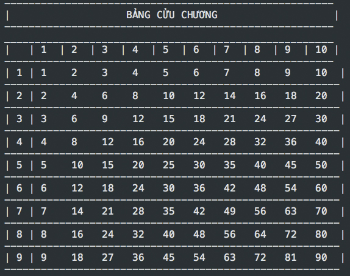
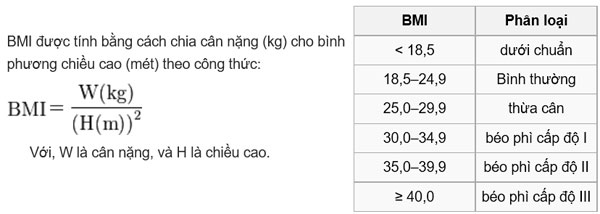

# Cấu trúc lập trình - Control Structure

## Chạy chương trình


Tên file: **if_else.js**

Thì lệnh chạy sẽ là:

```javascript
node if_else.js
```

## Hướng dẫn

[Bài 1: Các toán tử đặc biệt trong javascript](https://github.com/TechMaster/JavaScriptByExamples/tree/master/cautruc_laptrinh/cac_toan_tu_dac_biet.md)

[Bài 2: If else](https://github.com/TechMaster/JavaScriptByExamples/tree/master/cautruc_laptrinh/if_else.md)

[Bài 3: For](https://github.com/TechMaster/JavaScriptByExamples/tree/master/cautruc_laptrinh/for.md)

[Bài 4: While - Do while](https://github.com/TechMaster/JavaScriptByExamples/tree/master/cautruc_laptrinh/while_do_while.md)

[Bài 5: Switch Case](https://github.com/TechMaster/JavaScriptByExamples/tree/master/cautruc_laptrinh/switch_case.md)

[Bài 6: Break - Continue](https://github.com/TechMaster/JavaScriptByExamples/tree/master/cautruc_laptrinh/break_continue.md)

## Bài tập tổng

Sử dụng kiến thức đã học để làm bài tập

Bài 1. Nhập vào 1 số lẻ >=3. Hãy vẽ hình thoi.

Bài 2. Vẽ bảng cửu chương như hình



Bài 3. Tính chỉ số BMI

Gợi ý: 



Bài 4. Anh An gửi tiết kiệm vào ngân hàng 100.000.000 đ, lãi suất 0.7%. Tính cả vốn lẫn lãi sau 8 tháng.

Gợi ý:

Tháng 1: Số tiền là: a + a * r = a * ( 1 + r )

Tháng 2: Số tiền là: a * (1 + r) + a * (1 + r)r = a * (1 + r)^2

...

Tháng n: Số tiền là: a * (1 + r)^n

## Giải

Bài 1.

```javascript
let m = 9; // Đầu vào
let i = 0; // Tăng dần ở mỗi vòng lặp
let n = m; // Gán = số đầu vào vì để giảm dần
let u = 1; // u mỗi ở mỗi vòng lặp 2 đến n-1 sẽ tăng lên 2 vì khoảng cách bên trong giữa 2 dấu '*' mỗi vòng lặp cách nhau 2 đơn vị
let v = 1; // Ban đầu mỗi vòng lặp v tăng 2 cho đến khi u < m - 2 thì v giảm đi 2. v chính là khoảng cách bên trong 2 dấu '*'
while(n > 0){
    let space_ = '';
    if(m === n || n === 1){
        n_space = Math.abs(Math.floor((n-i)/2));

        for(let j = 0; j < n_space; j++){
            space_ += ' ';
        }

        console.log(space_ + '*' + space_);
    }else{
        n_space = Math.abs(Math.floor((n-i)/2));

        for(let j = 0; j < n_space; j++){
            space_ += ' ';
        }

        let between_space = '';

        for(let j = 0; j < v; j++){
            between_space += ' ';
        }

        console.log(space_ + '*' + between_space + '*' + space_);

        if(u < m - 2) {
            v += 2;
        }else{
            v -= 2;
        }
        u += 2;
    }
    i++;
    n--;
}
```

Bài 2.

```javascript
console.log('------------------------------------------------------');
console.log('|                   BẢNG CỬU CHƯƠNG                   |');
console.log('------------------------------------------------------');
console.log('______________________________________________________');
console.log('|   | 1  | 2  | 3  | 4  | 5  | 6  | 7  | 8  | 9  | 10 |');
console.log('------------------------------------------------------');
for(let i = 1; i < 10; i++){
    let str = '';
    str = '| ' + i + ' |';
    for(let j = 1; j < 11; j++){
        if(i * j >= 10) {
            str += ' ' + i * j + '  ';
        }else{
            str += ' ' + i * j + '   ';
        }
    }
    console.log(str + '|');
    console.log('-------------------------------------------------------')
}
```

Bài 3.

```javascript
let canNang = 80;
let chieuCao = 1.7;

let BMI = canNang / (chieuCao * chieuCao)

if(BMI >= 40){
    console.log('Béo phì cấp độ III')
}else if(BMI >= 35){
    console.log('Béo phì cấp độ II')
}else if(BMI >= 30){
    console.log('Béo phì cấp độ I')
}else if(BMI >= 25){
    console.log('Thừa cân')
}else if(BMI >= 18.5){
    console.log('Bình thường')
}else{
    console.log('Dưới chuẩn')
}
```

Bài 4.

```javascript
let tienGui = 100000000;
let laiSuat = 0.007;
let thangGui = 8;

let tongtien = tienGui * Math.pow((1 + laiSuat),thangGui);

console.log('Cả vốn lẫn lãi là: ', tongtien);
```