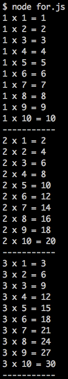

# For - Cấu trúc lập trình

Dùng để lặp tất cả phần tử trong mảng, mảng đối tượng hoặc trong một khoảng giá trị nào đó để xử lý dữ liệu.

### 1) Vòng lặp For

Dùng để lặp trong một khoảng giá trị.

Cú pháp:

```javascript
for (statement 1; statement 2; statement 3) {
    //Câu lệnh
}
```

**Giải thích:**

- statement 1: Được thực hiện trước khi vòng lặp bắt đầu.
- statement 2: Điều kiện để vòng lặp tiếp tục chạy.
- statement 3: Được thực hiện sau mỗi vòng lặp được thực thi

##### Sức mạnh của vòng lặp

**Ví dụ:** In ra số từ 1 đến 9

Không sử dụng vòng lặp:

```javascript
console.log(1);
console.log(2);
console.log(3);
console.log(4);
console.log(5);
console.log(6);
console.log(7);
console.log(8);
console.log(9);
```

Sử dụng vòng lặp:

```javascript
for(let i = 1; i < 10; i++){
    console.log(i);
}
```

Như vậy có thể thấy vòng lặp **For** sẽ giúp code gọn hơn và khi sửa code sẽ đỡ mất thời gian hơn.

### 2) For in

Dùng để lấy dữ liệu từ mảng hoặc mảng đối tượng.

Biến **key** sẽ đc gán bằng thuộc tính khác nhau ở mỗi vòng lặp

**key** của mảng là số, **key** của mảng đối tượng là số hoặc chuỗi.

Cú pháp:

```javascript
for (key in object) {
    //Câu lệnh
}
```

Ví dụ:

- Lấy dữ liệu từ mảng:

    ```javascript
    let arr = ['Apple', 'Orange', 'Banana', 'Lemon'];

    for(key in arr){
        console.log('key: ' + key + ', value: ' + arr[key]); //Có sử dụng lấy dữ liệu trong mảng
    }
    ```
    
    Kết quả:

    ```
    key: 0, value: Apple
    key: 1, value: Orange
    key: 2, value: Banana
    key: 3, value: Lemon
    ```

    **Giải thích:** Thuộc tính lần lượt là 0, 1, 2, 3, Giá trị tưởng ứng: Apple, Orange, Banana, Lemon

- Lấy dữ liệu từ mảng đối tượng:
    
    ```javascript
    let obj = {
        'apple': 'Apple',
        'orange': 'Orange',
        'banana': 'Banana',
        'lemon': 'Lemon'
    };
    
    for(key in obj){
        console.log('key: ' + key + ', value: ' + obj[key]); //Có sử dụng lấy dữ liệu trong mảng đối tượng
    }
    ```
    Kết quả:

    ```
    key: apple, value: Apple
    key: orange, value: Orange
    key: banana, value: Banana
    key: lemon, value: Lemon
    ```
    
    **Giải thích:** Thuộc tính lần lượt là: apple, orange, banana, lemon, Giá thị tương ứng: Apple, Orange, Banana, Lemon.
   

### 3) For of

Khác với **For in**, **For of** chỉ lấy giá trị trong mảng.

**Chú ý:** Chỉ sử dụng được cho mảng, không dùng cho mảng đối tượng.

Cú pháp: 

```javascript
for (variable of array) {
    //Câu lệnh
}
```

Ví dụ:

```javascript
let arr = ['Apple', 'Orange', 'Banana', 'Lemon'];

for(key of arr){
    console.log(key);
}
```

Kết quả:

```
Apple
Orange
Banana
Lemon
```

### 4) forEach

**forEach** chỉ dùng cho mảng.

Cú pháp:

- Cách 1: Lấy cả thuộc tính và giá trị

    ```javascript
    arr.forEach(function(value,index){
        // Câu lệnh
    });
    ```
    
- Cách 2: Chỉ lấy giá trị

    ```javascript
    arr.forEach(function(value){
        // Câu lệnh
    });
    ```

Ví dụ:

```javascript
let arr = ['Apple', 'Orange', 'Banana', 'Lemon'];

arr.forEach(function(value,index){
    console.log('Thuộc tính: ' + index + ', Giá trị: ' + value)
});
```

Kết quả:

```
Thuộc tính: 0, Giá trị: Apple
Thuộc tính: 1, Giá trị: Orange
Thuộc tính: 2, Giá trị: Banana
Thuộc tính: 3, Giá trị: Lemon
```

# Bài tập

1. Sử dụng vòng lặp **for** để vẽ bảng cửu chương như hình:


2. Tính giai thừa n.