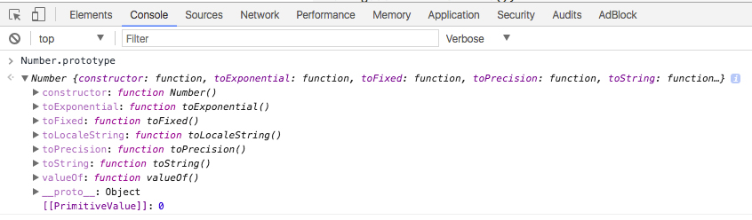

# Prototype

Prototype trong javascript giống như các phương thức và thuộc tính của đối tượng. Mỗi đối tượng trong javascript đều có Prototype riêng để lưu trữ thuộc tính và phương thức của nó.

Trong javascript, trừ _null_ và _undefined_ thì các toàn bộ kiểu còn lại là object.

Prototype của mỗi object chính là cha của nó, cha của String là String.prototype, cha của Number là Number.prototype, của Array là Array.prototype.

Ví dụ với prototype của Number



Khi thêm Prototype thì những thằng con của nó cũng sử dụng được

```javascript
let a = 12.3456;
console.log(a.toFixed(2)); // 12.35
console.log(a.toString()); // 12.3456. 12.3456 là 1 chuỗi
```

### Tạo mới Object

1. Tạo Object có prototype là Object.prototype

```javascript
let User = {
    //Thuộc tính
    username: 'techmaster',
    password: '123456',
    
    //Phương thức
    showInfo: function(){
        console.log(this.username, this.password);
    }
}
```

2. Tạo Object có prototype mới

```javascript
function User(username, password) {
    //Thuộc tính
    this.username = username;
    this.password = password;
    
    //Phương thức
    this.showInfo = function(){
        console.log(this.username, this.password);
    }
}
let firstUser = new User('techmaster', '111111');
```

- prototype mới là User.prototype

- User.prototype kế thừa từ Object.prototype


### Bổ sung thuộc tính, phương thức

Chúng ta có thể thêm prototype cho Number, String, Object, Array.

- Thêm prototype cho Number

```javascript
Number.prototype.giaTriMoi = 1232;
Number.prototype.x2 = function(){
    return this + this;
};
let a = 11;
console.log(a.giaTriMoi); // 1232
console.log(a.x2()); // 22
```

- Thêm prototype cho Array

```javascript
Array.prototype.giaTriMoi = '1111';
Array.prototype.laypt2 = function(){ // laypt2: lấy phần tử thứ 2
    return this[1];
};
let b = [9,6,7,4,23];
console.log(b.giaTriMoi); // 1111
console.log(b.laypt2()); // 6
```

Thêm Prototype cho Object

```javascript
Object.prototype.giaTriMoi = '1111';
Object.prototype.name = function(){
    return this.firstName + ' ' + this.lastName;
};
let b = {
    firstName: 'Thanh',
    lastName: 'Dat'
};
console.log(b.giaTriMoi); // 1111
b.giaTriMoi = '2222';
console.log(b.giaTriMoi); // 2222
console.log(b.name()); // Thanh Dat
```

Thêm Prototype cho String

```javascript
String.prototype.giaTriMoi = 'text';
String.prototype.toArray = function(){
    return this.split(' ');
};
let b = 'Thanh Dat';
console.log(b.giaTriMoi); // text
console.log(b.toArray()); // [ 'Thanh', 'Dat' ]
```

Thêm Prototype cho Object mới kế thừa từ Object

```javascript
function User(username, password) {
    //Thuộc tính
    this.username = username;
    this.password = password;
    
    //Phương thức
    this.showInfo = function(){
        console.log(this.username, this.password);
    }
}
let firstUser = new User('techmaster', '111111');

Object.prototype.cha = '2222';
User.prototype.con = '3333';

let a = {a:1};
console.log(a.cha); // 2222
console.log(a.con); // undefined
console.log(firstUser.cha); // 2222
console.log(firstUser.con); // 3333
```

- Thằng **a** có prototype là Object.prototype nên ko sử dụng được User.prototype

- Thằng firstUser có prototype là User.prototype, User.prototype được kế thừa từ Object.prototype nên nó có thể sử dụng được Object.prototype